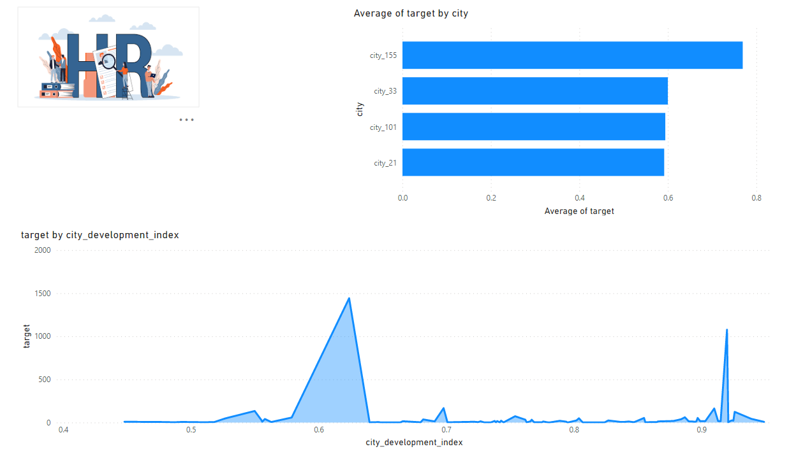
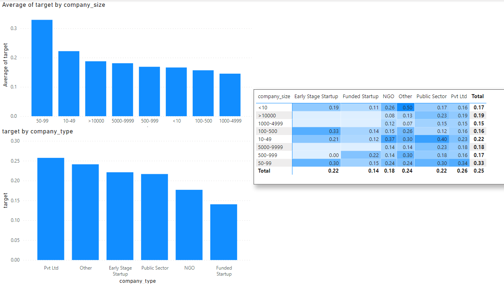
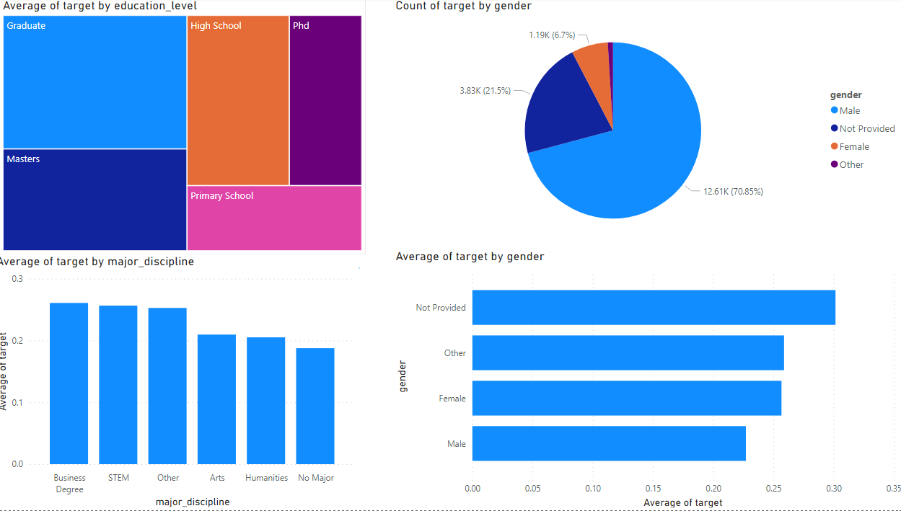
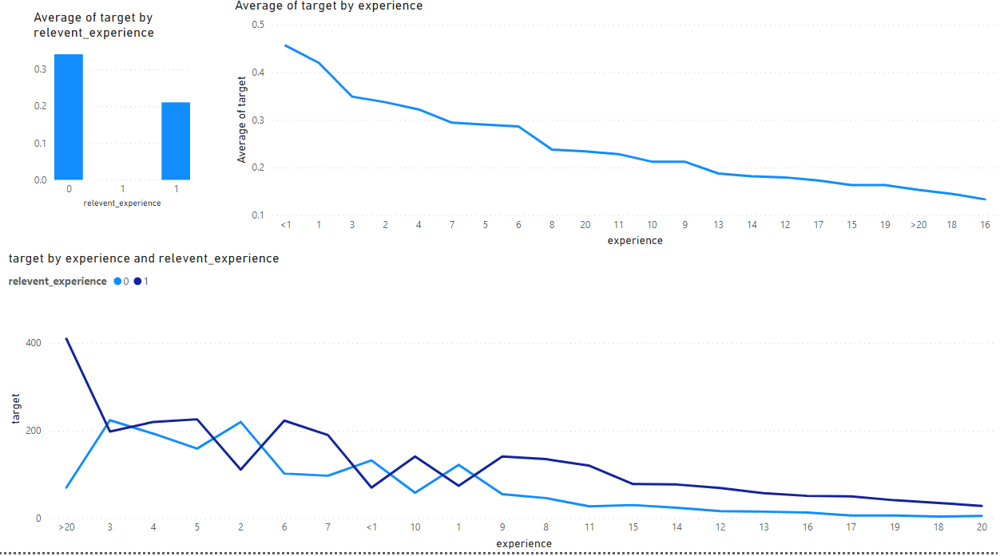
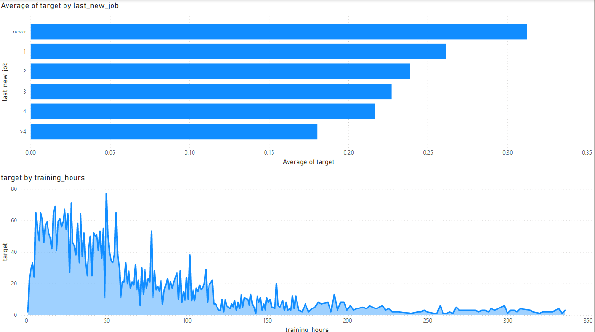

# hr_analytics

# Description

A company is looking to recruit people from among those who have completed some of the company's courses. The company needs to know which of these candidates really want to work for the company after the training because it helps to reduce the cost and time as well as the quality of training.

---
## Dashboard demo

